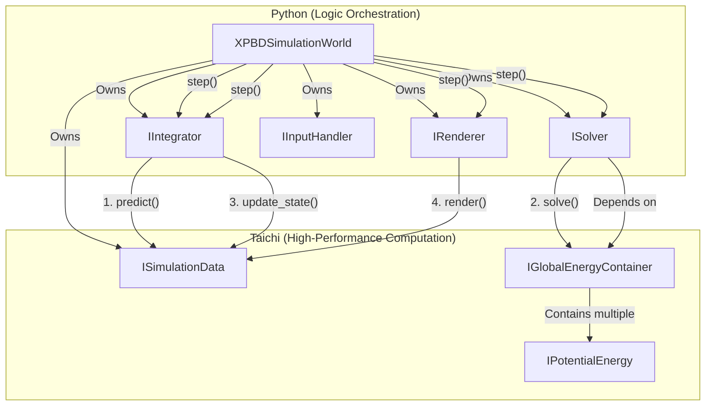
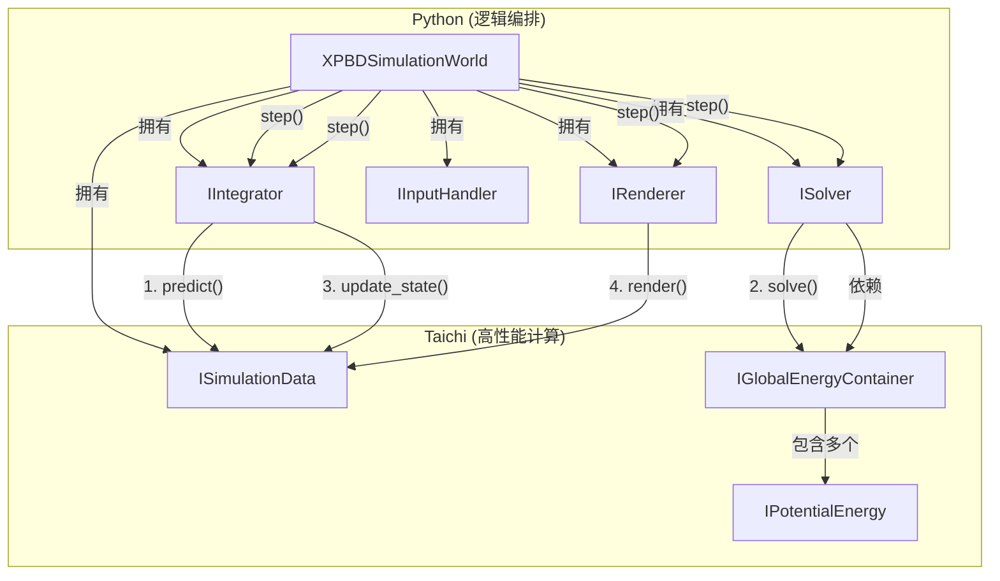

# Potentia: A Unified, Research-Oriented Physics Simulation Framework

**Potentia** (from the Latin for "Potential Energy") is a high-performance, modular physics simulation framework based on [Taichi](https://github.com/taichi-dev/taichi).

Its core design is built on a unified perspective: **all physical constraints are abstracted as "Potential Energy" (`IPotentialEnergy`), and all simulation methods (PBD, XPBD, PD...) are abstracted as "Optimizers" (`ISolver`) that solve energy minimization problems.**

This project aims to provide researchers in computer graphics and physics simulation with a clear, decoupled, and easily extensible platform, enabling them to **conveniently implement, validate, and compare different physics simulation methods**.

It is not limited to any specific solver but instead provides a set of universal "building blocks":

  * Want to research a new energy model? Simply implement a new `IPotentialEnergy`.
  * Want to test a new solving strategy? Simply implement a new `ISolver`.
  * Want to mix and match? The framework's decoupled design allows you to freely combine different energy terms and solvers.

This project currently focuses on Finite Element Method (FEM)-based continuum mechanics (e.g., elastic soft bodies) and includes built-in, runnable implementations of Position Based Dynamics (PBD) and Projective Dynamics (PD).

## Core Features

  * **Energy-Driven Unified Architecture**: Whether it's the hard constraints of PBD or the quadratic energy function of PD, all are unified under the `IPotentialEnergy` interface. This keeps the framework neutral to the simulation method.
  * **Extensibility Born for Research**: Strict dependency inversion and interface segregation allow researchers to swap any core component of the framework (`ISolver`, `IIntegrator`, `IPotentialEnergy`) like Lego blocks, without modifying the framework itself.
  * **High-Performance Taichi Backend**: All intensive computations (energy, gradients, projections) are executed in parallel within Taichi Kernels, ensuring real-time simulation performance.
  * **Clear Separation of Concerns (Python vs. Taichi)**:
      * **Python (Host Side)**: Responsible for high-level logic orchestration, object creation, dependency injection, and the main loop.
      * **Taichi (Compute Side)**: Responsible for all low-level mathematical and physical computations.
  * **Out-of-the-Box Implementations**: Includes complete implementations of PBD and PD solvers, which can serve as a baseline for research and learning.

## Architecture Philosophy: Everything is Energy Minimization

The core of Potentia is the decoupling of the `ISolver` (optimizer) and the `IPotentialEnergy` (physical model).

1.  **`IIntegrator` (Integrator)**: Responsible for time integration, calculating a "predicted" position $s$ (e.g., using implicit Euler: $s = q_n + \Delta t v_n + \Delta t^2 M^{-1} f_{ext}$).
2.  **`ISolver` (Solver)**: Accepts the predicted position $s$ as input. Its **sole** objective is to find a new position $q_{n+1}$ that minimizes the sum of all registered `IPotentialEnergy` terms.
3.  **`IPotentialEnergy` (Energy Term)**: Defines the mathematical form of the physical model (e.g., strain energy for PD, or distance constraints for PBD). It exposes methods to the `ISolver` for calculating energy, gradients, or performing projections.

This design makes the framework extremely flexible:

  * **PBD Solver (`PBD_Solver`)**: Takes $s$ as an initial guess, then iteratively "projects" all constraints provided by the `IPotentialEnergy` terms.
  * **PD Solver (`PD_Solver`)**: Uses $s$ as the $s$-point for the PD inertial term, then performs Local-Global iterations to minimize the quadratic energy function.
  * **XPBD Solver (`XPBD_Solver`)**: Can be implemented as an `ISolver` that collects constraint gradients from `IPotentialEnergy` and updates positions using $\Delta \lambda$.

### Architecture Component Diagram



## Example: `xpbd.py`

The framework's assembly is done entirely on the Python side, demonstrating its clear separation of logic:

```python
import abc
from typing import List

import taichi as ti
import taichi.math as tm

from collision.base import ICollisionHandler
from data.base import ISimulationData
from data.mass_point_data import MassPointData
from energies.distance_energy import DistanceEnergy
from forces.gravity_force import GravityForce
from integrators.implicit_euler_integrator import ImplicitEulerIntegrator
from mesh.trimesh import TriMesh
from objects.mesh_object import MeshObject
from renderers.mesh_renderer import MeshRenderer
from solvers.xpbd_solver import XPBDSolver
from world.simulation_world import SimulationWorld
from controller.fp_input_handler import FPInputHandler

# Define a simple collision handler, which does nothing in this example
class DummyCollisionHandler(ICollisionHandler):
    def detect_and_create_potentials(self, data: ISimulationData, q_predict: ti.Field) -> List:
        return []


ti.init(arch=ti.cuda)

# 1. Assemble the simulation world's modules
# Set the max number of points for mesh objects
sim_data = MassPointData(max_point_num=10000)

energies_to_register = [DistanceEnergy.get_instance()]
solver = XPBDSolver(iterations=20)
integrator = ImplicitEulerIntegrator()
renderer = MeshRenderer(title="XPBD Mesh Simulation")
collision_handler = DummyCollisionHandler()

input_handler = FPInputHandler()

world = SimulationWorld(data=sim_data, 
                        solver=solver, 
                        integrator=integrator, 
                        collision_handler=collision_handler, 
                        renderer=renderer,
                        energies=energies_to_register,
                        input_handler=input_handler)

# 2. Add external forces
gravity = GravityForce(gravity=tm.vec3(0.0, -9.8, 0.0))
world.add_force(gravity)


# 3. Create and add simulation objects (e.g., sphere)

cube_mesh = TriMesh.create_cube()
sphere_mesh = TriMesh.create_sphere(radius=0.2, subdivisions=2)
cloth_mesh = TriMesh.from_obj("models/plane_30x30.obj")

cube_mesh.materialize()
sphere_mesh.materialize()
cloth_mesh.materialize()


cube_obj1 = MeshObject(mesh=cube_mesh, data=sim_data, translation=(0.0, 2.0, 0.0), face_color=(0.9, 0.3, 0.3))
cube_obj1.add_xpbd_distance_energy(stiffness=1e4)
cube_obj1.set_mass(0, -1.0)
world.add_object(cube_obj1)


# 4. Run the main simulation loop
frame = 0
while renderer.is_window_running():
    world.step(dt=1.0 / 60.0)
    frame += 1

```

## Example: `pd.py`

To change from XPBD to PD, simply replace the solver and energy.

```python
import abc
from typing import List, Dict, Any
import json

import taichi as ti
import taichi.math as tm

from collision.base import ICollisionHandler
from data.base import ISimulationData
from energies.base import IGlobalEnergyContainer
from data.mass_point_data import MassPointData
from energies.pd_bending_energy import PDBendingEnergy
from energies.pd_strain_energy import PDStrainEnergy
from forces.gravity_force import GravityForce
from integrators.implicit_euler_integrator import ImplicitEulerIntegrator
from mesh.trimesh import TriMesh
from objects.mesh_object import MeshObject
from renderers.mesh_renderer import MeshRenderer
from solvers.pd_solver import PDSolver
from world.simulation_world import SimulationWorld
from controller.fp_input_handler import FPInputHandler
from recorders import FrameRecorder, RecordingMode

# Define a simple collision handler, which does nothing in this example
class DummyCollisionHandler(ICollisionHandler):
    def detect_and_create_potentials(self, data: ISimulationData, q_predict: ti.Field) -> List:
        return []


def main():
    ti.init(arch=ti.cuda)

    # 1. Assemble the simulation world's modules
    # Set the max number of points
    sim_data = MassPointData(max_point_num=10000)

    energies_to_register = [PDBendingEnergy.get_instance(), PDStrainEnergy.get_instance()]
    # Key: PD requires passing the `data` to the solver's constructor
    solver = PDSolver(data=sim_data, iterations=5)
    integrator = ImplicitEulerIntegrator()
    renderer = MeshRenderer(title="PD Mesh Simulation")
    collision_handler = DummyCollisionHandler()

    input_handler = FPInputHandler()
    input_handler.set_paused_state(True)

    recorder = FrameRecorder(output_dir="captures/pd", mode=RecordingMode.RUNNING_ONLY, make_video=True, fps=60)

    world = SimulationWorld(data=sim_data, 
                            solver=solver, 
                            integrator=integrator, 
                            collision_handler=collision_handler, 
                            renderer=renderer,
                            energies=energies_to_register,
                            input_handler=input_handler,
                            recorder=recorder)

    # 2. Add external forces
    gravity = GravityForce(gravity=tm.vec3(0.0, -9.8, 0.0))
    world.add_force(gravity)

    # 3. Create and add simulation objects
    cube_mesh = TriMesh.create_cube()
    sphere_mesh = TriMesh.create_sphere(radius=0.2, subdivisions=2)
    cloth_mesh = TriMesh.from_obj("models/plane_30x30.obj")
    triangle_mesh = TriMesh.create_triangle((0.0, 0.0, 0.0), (1.0, 1.0, 1.0), (1.0, 0.0, 0.0))

    cube_mesh.materialize()
    sphere_mesh.materialize()
    cloth_mesh.materialize()
    triangle_mesh.materialize()

    obj1 = MeshObject(mesh=cloth_mesh, data=sim_data, translation=(1.0, 1.0, 1.0), face_color=(0.9, 0.3, 0.3), rotation=(30, 15, 60))


    obj1.add_pd_bending_energy(1e2)
    obj1.add_pd_strain_energy(1e6, 0.5, 1.5)
    obj1.set_mass(0, -1.0)
    

    world.add_object(obj1)


    # Key: PD needs to build and factorize the LHS once before the main loop (must be re-called if DoF/constraints or dt changes)
    dt = 1.0 / 60.0
    solver.build_lhs(sim_data, dt)


    # 4. Run the main simulation loop
    frame = 0
    recorder.start()
    while renderer.is_window_running():
        world.step(dt=dt)
        frame += 1

    recorder.stop()

if __name__ == "__main__":
    main()

```

# Potentia: 一个面向研究的统一物理模拟框架

**Potentia** (源自拉丁语“势能”) 是一个基于 [Taichi](https://github.com/taichi-dev/taichi) 的高性能、模块化物理模拟框架。

它的核心设计建立在一个统一的视角之上：**所有物理约束都被抽象为“势能”(`IPotentialEnergy`)，而所有模拟方法（PBD, XPBD, PD...）都被抽象为求解能量最小化问题的“优化器”(`ISolver`)。**

本项目旨在为图形学和物理模拟的研究人员提供一个清晰、解耦、易于扩展的平台，使其能够**极其方便地实现、验证和比较不同的物理模拟方法**。

它不局限于任何特定的求解器，而是提供了一套通用的“积木”：

  * 想研究新的能量模型？只需实现一个新的 `IPotentialEnergy`。
  * 想测试新的求解策略？只需实现一个新的 `ISolver`。
  * 想混合使用？框架的解耦设计允许你自由组合不同的能量项和求解器。

本项目目前主要关注基于有限元（FEM）的连续介质力学（如弹性柔体），并已内置了 Position Based Dynamics (PBD) 和 Projective Dynamics (PD) 的可运行实现。

## 核心特性

  * **能量驱动的统一架构**: 无论是 PBD 的硬约束，还是 PD 的二次能量函数，都被统一为 `IPotentialEnergy` 接口。这使得框架对模拟方法保持中立。
  * **为研究而生的可扩展性**: 严格的依赖倒置和接口隔离，允许研究人员像插拔乐高一样替换框架的任一核心组件 (`ISolver`, `IIntegrator`, `IPotentialEnergy`)，而无需修改框架本身。
  * **高性能 Taichi 后端**: 所有密集的计算（能量、梯度、投影）均在 Taichi Kernel 中并行执行，确保了实时模拟性能。
  * **清晰的职责分离 (Python vs. Taichi)**:
      * **Python (宿主端)**: 负责高层逻辑编排、对象创建、依赖注入和主循环。
      * **Taichi (计算端)**: 负责所有底层的数学和物理计算。
  * **开箱即用的实现**: 已包含 PBD 和 PD 求解器的完整实现，可作为研究和学习的基线。

## 架构哲学：万物皆为能量最小化

Potentia 的核心是解耦 `ISolver` (优化器) 和 `IPotentialEnergy` (物理模型)。

1.  **`IIntegrator` (积分器)**: 负责时间积分，计算出一个“预测”位置 $s$（例如，使用隐式欧拉法：$s = q_n + \Delta t v_n + \Delta t^2 M^{-1} f_{ext}$）。
2.  **`ISolver` (求解器)**: 接受预测位置 $s$ 作为输入。它的**唯一**目标是找到一个新的位置 $q_{n+1}$，使得所有已注册的 `IPotentialEnergy` 的总和最小化。
3.  **`IPotentialEnergy` (能量项)**: 定义了物理模型的数学形式（例如PD的应变能，或PBD的距离约束）。它向 `ISolver` 暴露计算能量、梯度或执行投影的方法。

这种设计使得框架变得极其灵活：

  * **PBD 求解器 (`PBD_Solver`)**: 将 $s$ 作为初始猜测，然后迭代地“投影”所有 `IPotentialEnergy` 提供的约束。
  * **PD 求解器 (`PD_Solver`)**: 将 $s$ 作为 PD 惯性项的 $s$ 点，然后执行局部-全局（Local-Global）迭代来最小化二次能量函数。
  * **XPBD 求解器 (`XPBD_Solver`)**：可以被实现为一个 `ISolver`，它收集 `IPotentialEnergy` 的约束梯度，并使用 $\Delta \lambda$ 更新位置。

### 架构组件图



## 示例：`xpbd.py`

框架的组装完全在 Python 侧完成，展示了其清晰的逻辑分离：

```python
import abc
from typing import List

import taichi as ti
import taichi.math as tm

from collision.base import ICollisionHandler
from data.base import ISimulationData
from data.mass_point_data import MassPointData
from energies.distance_energy import DistanceEnergy
from forces.gravity_force import GravityForce
from integrators.implicit_euler_integrator import ImplicitEulerIntegrator
from mesh.trimesh import TriMesh
from objects.mesh_object import MeshObject
from renderers.mesh_renderer import MeshRenderer
from solvers.xpbd_solver import XPBDSolver
from world.simulation_world import SimulationWorld
from controller.fp_input_handler import FPInputHandler

# 定义一个简单的碰撞处理器，在这个示例中它什么也不做
class DummyCollisionHandler(ICollisionHandler):
    def detect_and_create_potentials(self, data: ISimulationData, q_predict: ti.Field) -> List:
        return []


ti.init(arch=ti.cuda)

# 1. 组装仿真世界的各个模块
# 为网格对象增加自由度上限
sim_data = MassPointData(max_point_num=10000)

energies_to_register = [DistanceEnergy.get_instance()]
solver = XPBDSolver(iterations=20)
integrator = ImplicitEulerIntegrator()
renderer = MeshRenderer(title="XPBD Mesh Simulation")
collision_handler = DummyCollisionHandler()

input_handler = FPInputHandler()

world = SimulationWorld(data=sim_data, 
                            solver=solver, 
                            integrator=integrator, 
                            collision_handler=collision_handler, 
                            renderer=renderer,
                            energies=energies_to_register,
                            input_handler=input_handler)

# 2. 添加外力
gravity = GravityForce(gravity=tm.vec3(0.0, -9.8, 0.0))
world.add_force(gravity)


# 3. 创建并添加仿真对象（球体）

cube_mesh = TriMesh.create_cube()
sphere_mesh = TriMesh.create_sphere(radius=0.2, subdivisions=2)
cloth_mesh = TriMesh.from_obj("models/plane_30x30.obj")

cube_mesh.materialize()
sphere_mesh.materialize()
cloth_mesh.materialize()


cube_obj1 = MeshObject(mesh=cube_mesh, data=sim_data, translation=(0.0, 2.0, 0.0), face_color=(0.9, 0.3, 0.3))
cube_obj1.add_xpbd_distance_energy(stiffness=1e4)
cube_obj1.set_mass(0, -1.0)
world.add_object(cube_obj1)


# 4. 运行仿真主循环
frame = 0
while renderer.is_window_running():
    world.step(dt=1.0 / 60.0)
    frame += 1


```

## 示例：`pd.py`

从xpbd变成pd，只需替换solver和energy即可

```python
import abc
from typing import List, Dict, Any
import json

import taichi as ti
import taichi.math as tm

from collision.base import ICollisionHandler
from data.base import ISimulationData
from energies.base import IGlobalEnergyContainer
from data.mass_point_data import MassPointData
from energies.pd_bending_energy import PDBendingEnergy
from energies.pd_strain_energy import PDStrainEnergy
from forces.gravity_force import GravityForce
from integrators.implicit_euler_integrator import ImplicitEulerIntegrator
from mesh.trimesh import TriMesh
from objects.mesh_object import MeshObject
from renderers.mesh_renderer import MeshRenderer
from solvers.pd_solver import PDSolver
from world.simulation_world import SimulationWorld
from controller.fp_input_handler import FPInputHandler
from recorders import FrameRecorder, RecordingMode

# 定义一个简单的碰撞处理器，在这个示例中它什么也不做
class DummyCollisionHandler(ICollisionHandler):
    def detect_and_create_potentials(self, data: ISimulationData, q_predict: ti.Field) -> List:
        return []


def main():
    ti.init(arch=ti.cuda)

    # 1. 组装仿真世界的各个模块
    # 为网格对象增加自由度上限
    sim_data = MassPointData(max_point_num=10000)

    energies_to_register = [PDBendingEnergy.get_instance(), PDStrainEnergy.get_instance()]
    # 关键：PD 需要把 data 传入求解器构造函数
    solver = PDSolver(data=sim_data, iterations=5)
    integrator = ImplicitEulerIntegrator()
    renderer = MeshRenderer(title="PD Mesh Simulation")
    collision_handler = DummyCollisionHandler()

    input_handler = FPInputHandler()
    input_handler.set_paused_state(True)

    recorder = FrameRecorder(output_dir="captures/pd", mode=RecordingMode.RUNNING_ONLY, make_video=True, fps=60)

    world = SimulationWorld(data=sim_data, 
                                solver=solver, 
                                integrator=integrator, 
                                collision_handler=collision_handler, 
                                renderer=renderer,
                                energies=energies_to_register,
                                input_handler=input_handler,
                                recorder=recorder)

    # 2. 添加外力
    gravity = GravityForce(gravity=tm.vec3(0.0, -9.8, 0.0))
    world.add_force(gravity)

    # 3. 创建并添加仿真对象
    cube_mesh = TriMesh.create_cube()
    sphere_mesh = TriMesh.create_sphere(radius=0.2, subdivisions=2)
    cloth_mesh = TriMesh.from_obj("models/plane_30x30.obj")
    triangle_mesh = TriMesh.create_triangle((0.0, 0.0, 0.0), (1.0, 1.0, 1.0), (1.0, 0.0, 0.0))

    cube_mesh.materialize()
    sphere_mesh.materialize()
    cloth_mesh.materialize()
    triangle_mesh.materialize()

    obj1 = MeshObject(mesh=cloth_mesh, data=sim_data, translation=(1.0, 1.0, 1.0), face_color=(0.9, 0.3, 0.3), rotation=(30, 15, 60))


    obj1.add_pd_bending_energy(1e2)
    obj1.add_pd_strain_energy(1e6, 0.5, 1.5)
    obj1.set_mass(0, -1.0)
    

    world.add_object(obj1)


    # 关键：PD 需要在进入主循环前构建并分解一次 LHS（若 DoF/约束 或 dt 改变需重新调用）
    dt = 1.0 / 60.0
    solver.build_lhs(sim_data, dt)


    # 4. 运行仿真主循环
    frame = 0
    recorder.start()
    while renderer.is_window_running():
        world.step(dt=dt)
        frame += 1

    recorder.stop()

if __name__ == "__main__":
    main()

```
