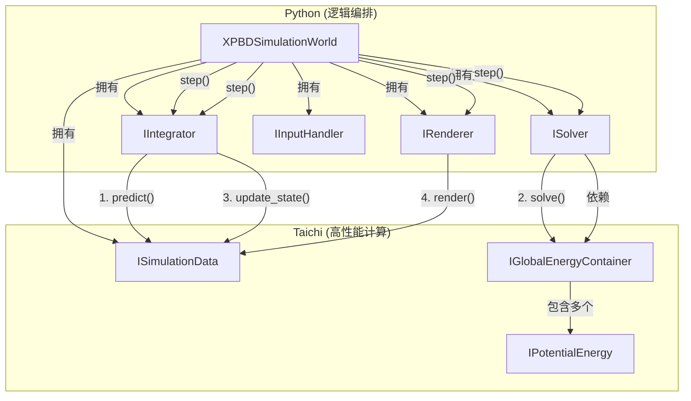

# Potentia: 一个面向研究的统一物理模拟框架

**Potentia** (源自拉丁语“势能”) 是一个基于 [Taichi](https://github.com/taichi-dev/taichi) 的高性能、模块化物理模拟框架。

它的核心设计建立在一个统一的视角之上：**所有物理约束都被抽象为“势能”(`IPotentialEnergy`)，而所有模拟方法（PBD, XPBD, PD...）都被抽象为求解能量最小化问题的“优化器”(`ISolver`)。**

本项目旨在为图形学和物理模拟的研究人员提供一个清晰、解耦、易于扩展的平台，使其能够**极其方便地实现、验证和比较不同的物理模拟方法**。

它不局限于任何特定的求解器，而是提供了一套通用的“积木”：

  * 想研究新的能量模型？只需实现一个新的 `IPotentialEnergy`。
  * 想测试新的求解策略？只需实现一个新的 `ISolver`。
  * 想混合使用？框架的解耦设计允许你自由组合不同的能量项和求解器。

本项目目前主要关注基于有限元（FEM）的连续介质力学（如弹性柔体），并已内置了 Position Based Dynamics (PBD) 和 Projective Dynamics (PD) 的可运行实现。

## 核心特性

  * **能量驱动的统一架构**: 无论是 PBD 的硬约束，还是 PD 的二次能量函数，都被统一为 `IPotentialEnergy` 接口。这使得框架对模拟方法保持中立。
  * **为研究而生的可扩展性**: 严格的依赖倒置和接口隔离，允许研究人员像插拔乐高一样替换框架的任一核心组件 (`ISolver`, `IIntegrator`, `IPotentialEnergy`)，而无需修改框架本身。
  * **高性能 Taichi 后端**: 所有密集的计算（能量、梯度、投影）均在 Taichi Kernel 中并行执行，确保了实时模拟性能。
  * **清晰的职责分离 (Python vs. Taichi)**:
      * **Python (宿主端)**: 负责高层逻辑编排、对象创建、依赖注入和主循环。
      * **Taichi (计算端)**: 负责所有底层的数学和物理计算。
  * **开箱即用的实现**: 已包含 PBD 和 PD 求解器的完整实现，可作为研究和学习的基线。

## 架构哲学：万物皆为能量最小化

Potentia 的核心是解耦 `ISolver` (优化器) 和 `IPotentialEnergy` (物理模型)。

1.  **`IIntegrator` (积分器)**: 负责时间积分，计算出一个“预测”位置 $s$（例如，使用隐式欧拉法：$s = q_n + \Delta t v_n + \Delta t^2 M^{-1} f_{ext}$）。
2.  **`ISolver` (求解器)**: 接受预测位置 $s$ 作为输入。它的**唯一**目标是找到一个新的位置 $q_{n+1}$，使得所有已注册的 `IPotentialEnergy` 的总和最小化。
3.  **`IPotentialEnergy` (能量项)**: 定义了物理模型的数学形式（例如PD的应变能，或PBD的距离约束）。它向 `ISolver` 暴露计算能量、梯度或执行投影的方法。

这种设计使得框架变得极其灵活：

  * **PBD 求解器 (`PBD_Solver`)**: 将 $s$ 作为初始猜测，然后迭代地“投影”所有 `IPotentialEnergy` 提供的约束。
  * **PD 求解器 (`PD_Solver`)**: 将 $s$ 作为 PD 惯性项的 $s$ 点，然后执行局部-全局（Local-Global）迭代来最小化二次能量函数。
  * **XPBD 求解器 (`XPBD_Solver`)**：可以被实现为一个 `ISolver`，它收集 `IPotentialEnergy` 的约束梯度，并使用 $\Delta \lambda$ 更新位置。

### 架构组件图



## 概念示例：`main.py`

(仅作概念展示，项目未全部完成)

框架的组装完全在 Python 侧完成，展示了其清晰的逻辑分离：

```python
import taichi as ti
from potentia.data import TetMeshData
from potentia.integrators import ImplicitEulerIntegrator
from potentia.solvers import PDSolver
from potentia.collision import ContinuousCollision
from potentia.renderers import GGIRenderer
from potentia.world import SimulationWorld
from potentia.objects import TetMeshObject

ti.init(arch=ti.gpu)

# 1. 创建全局状态容器
sim_data = TetMeshData()

# 2. 选择并实例化核心组件 (依赖注入)
integrator = ImplicitEulerIntegrator()
solver = PDSolver(iterations=10)
renderer = GGIRenderer()
energy_container = GlobalEnergyContainer() # (单例)

# 3. 组装世界
world = SimulationWorld(
    data=sim_data,
    solver=solver,
    integrator=integrator,
    renderer=renderer,
    energy_container=energy_container
)

# 4. 加载静态拓扑
static_mesh = load_tet_mesh_file("dragon.msh")

# 5. 创建模拟物体 (工厂模式)
# IMeshObject 将静态 mesh 绑定到 sim_data 的一个切片上
dragon_obj = TetMeshObject(mesh=static_mesh, data=sim_data)

# 6. 为物体创建能量项 (并自动注册到全局容器)
dragon_obj.create_pd_strain_energy(stiffness=1e5)
dragon_obj.create_pbd_volume_energy(stiffness=1e3) # <-- 混合能量模型

# 7. 添加物体和外力
world.add_object(dragon_obj)
world.add_force(Gravity(g=[0, -9.8, 0]))

# 8. 运行主循环
while renderer.is_window_running():
    world.step(dt=0.016)

```
